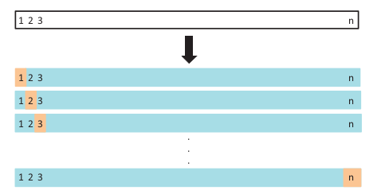

```{r setup, include=FALSE}
options(htmltools.dir.version = FALSE)

knitr::opts_chunk$set(
  echo = FALSE, 
  message = FALSE, 
  warning = FALSE,
  fig.width=6, 
  fig.height=6,
  fig.align='center'
)

library(tidyverse)
```

# Sumário

- Viés e variância

- Base treino e base teste

- Validação cruzada

- Estimando a performance do modelo

---

# Viés/variância

- **Viés**: o erro induzido por aproximar um fenômeno real, que pode pode ser extremamente complicado, por um modelo muito mais simples.

- **Variância**: o quanto as estimativas dos parâmetros mudariam se nós os estimarmos usando uma base diferente. 

<!-- We would like our model to have minimum variance and minimum bias. But what we see in practice is that methods that reduce variance usually increases bias and vice-versa. -->

---

# Exemplo

Vamos encontrar um bom modelo para ajustar esse conjunto de 10 pontos.

```{r}
set.seed(7)

dados <- data_frame(
  x = runif(10),
  y = 2*x + 3*x^2 + rnorm(10, 0, 0.15) 
)

dados2 <- data_frame(
  x = runif(100),
  y = 2*x + 3*x^2 + rnorm(100, 0, 0.1) 
)

modelo <- lm(y ~ x, data = dados)
modelo2 <- lm(y ~ poly(x, 2), data = dados)


ggplot(dados, aes(x = x, y = y)) + 
  geom_point() + 
  theme_bw()
```

---

# Exemplo

**Regressão linear simples**: $y = b_0 + b_1x + e$

```{r}
p <- ggplot(dados, aes(x = x, y = y)) + geom_point() + 
  geom_smooth(formula = y ~ x, colour = "red", se = FALSE, method = 'lm') +
  theme_bw()

p
```

---

# Exemplo

**Regressão linear simples**: $y = b_0 + b_1x + e$

```{r}
calcula_rmse <- function(modelo) {
  mean(residuals(modelo)^2) %>%
  sqrt() %>% 
  round(3)
}

rmse <- calcula_rmse(modelo) %>%
  str_c("RMSE: ", .)

p + geom_text(aes(x = 0.25, y = 4, label = rmse))
```

---

# Exemplo

**Modelo quadrático**: $y = b_0 + b_1x + b_2x^2 + e$

```{r, fig.align='center'}
rmse <- calcula_rmse(modelo2) %>%
  str_c("RMSE: ", .)
  

ggplot(dados, aes(x = x, y = y)) + geom_point() + 
  geom_smooth(formula = y ~ x, colour = "red", se = FALSE, method = 'lm') +
  geom_smooth(formula = y ~ poly(x, 2), colour = "orange", se = FALSE, method = 'lm') +
  geom_text(aes(x = 0.25, y = 4, label = rmse)) +
  theme_bw()
```

---

# Exemplo

```{r}
poly_lm <- function(dados, d) {
  lm(y ~ poly(x, degree = d, raw = TRUE), data = dados)
}

modelos <- map(1:9, poly_lm, dados = dados)
rmse <- 
  map(modelos, calcula_rmse) %>% 
  purrr::flatten_dbl()

tibble(`Grau do polinômio` = 1:9, RMSE = rmse) %>% 
  knitr::kable(format = "html", align = c("c", "c"))
```


---

# Exemplo

**Modelo polinomial de grau nove**: $y = b_0 + b_1x + b_2x^2 + \cdots + b_9x^9 + e$

```{r, fig.align='center'}
ggplot(dados, aes(x = x, y = y)) + geom_point() + 
  geom_smooth(formula = y ~ x, colour = "red", se = FALSE, method = 'lm') +
  geom_smooth(formula = y ~ poly(x, 2), colour = "orange", se = FALSE, method = 'lm') +
  geom_smooth(formula = y ~ poly(x, 9), colour = "blue", se = FALSE, method = 'lm') +
  theme_bw()
```

---
# Exemplo

E se nós obtermos mais dados? As curvas representam os modelos ajustados com os 10 pontos iniciais.

```{r, fig.align='center'}
ggplot(dados, aes(x = x, y = y)) + geom_point() + 
  geom_smooth(formula = y ~ x, colour = "red", se = FALSE, method = 'lm') +
  geom_smooth(formula = y ~ poly(x, 2), colour = "orange", se = FALSE, method = 'lm') +
  geom_smooth(formula = y ~ poly(x, 9), colour = "blue", se = FALSE, method = 'lm') +
  geom_point(data = dados2, aes(x = x, y = y)) +
  theme_bw()
```

---

# Exemplo

```{r}
calcula_rmse_newdata <- function(modelo, newdata) {
  mean((newdata$y - predict(modelo, newdata = newdata))^2) %>%
  sqrt() %>% 
  round(3)
}

rmse <- 
  map(modelos, calcula_rmse_newdata, newdata = dados2) %>% 
  purrr::flatten_dbl()

tibble(`Grau do polinômio` = 1:9, RMSE = rmse) %>% 
  knitr::kable(format = "html", align = c("c", "c"))
```

---

# Exemplo

Agora ajustando nos dados novos.

```{r, fig.align='center'}
ggplot(dados2, aes(x = x, y = y)) + geom_point() + 
  geom_smooth(formula = y ~ x, colour = "red", se = FALSE, method = 'lm') +
  geom_smooth(formula = y ~ poly(x, 2), colour = "orange", se = FALSE, method = 'lm') +
  geom_smooth(formula = y ~ poly(x, 9), colour = "blue", se = FALSE, method = 'lm') +
  theme_bw()
```

---

# Exemplo

```{r}
modelos <- map(1:9, poly_lm, dados = dados2)
rmse <- 
  map(modelos, calcula_rmse) %>% 
  purrr::flatten_dbl()

tibble(`Grau do polinômio` = 1:9, RMSE = rmse) %>% 
  knitr::kable(format = "html", align = c("c", "c"))
```

---

# Erros de treino e teste

- **Erro de treino**: é o erro encontrado ao aplicar o modelo na própria base utilizada para treiná-lo.

- **Erro de teste**: é o erro encontrado ao aplicar o modelo a uma base não utilizada no treino.

---

# Validação cruzada

**Validação cruzada**: usar uma porção dos dados, que não foi utilizada para no treino, para avaliar o erro de teste.

Tipos:

- Validation set
- LOOCV
- k-fold cross-validation

---

# Validation set

```{r}

```

---

# LOOCV

```{r}

```

---

# k-fold Cross Validation

```{r}
knitr::include_graphics("img/k-fold-cv.png")
```

---

# Regularização

- Regulariação se refere à técnica de incluir penalizações no algoritmo de estimação que encolhem as estimativas na direção do zero.

- Essa técnica pode levar a uma redução substencial da variância das predições ao custo de um pequeno aumento de viés.

---

# Regressão Ridge

Regularização considerando estimação por mínimos quadrados.

$$\sum_{i=1}^n \left(y_i - \beta_0 - \sum_{j=1}^p \beta_j x_{ij}\right)^2 + \lambda \sum_{j=1}^p \beta_j^2$$


---

# LASSO

(least absolute shrinkage and selection operator)


$$\sum_{i=1}^n \left(y_i - \beta_0 - \sum_{j=1}^p \beta_j x_{ij}\right)^2 + \lambda \sum_{j=1}^p |\beta_j|$$

