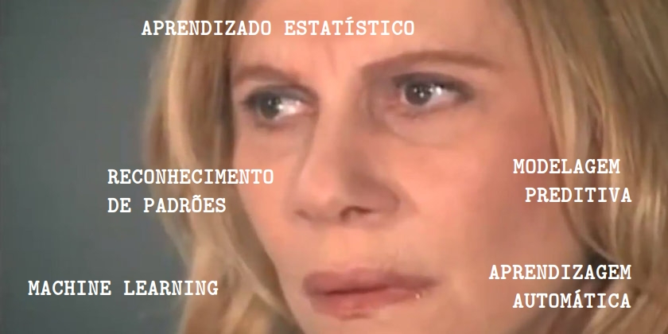
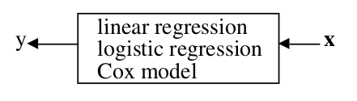
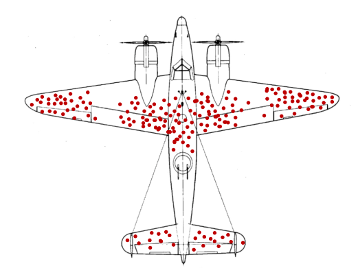

```{r setup, include=FALSE}
options(htmltools.dir.version = FALSE)
```

# Quem somos


<div class="dan">
  <lu>
    <li> Daniel Falbel </li>
    <li> dfalbel@curso-r.com </li>
    <li> IME-USP / Curso-R </li>
  </lu>
</div>

<div class="willy">
  <lu>
    <li> William Amorim </li>
    <li> williamorim@curso-r.com </li>
    <li> IME-USP / Curso-R </li>
  </lu>
</div>

---

# Sumário

- O que é Machine Learning?

- Machine Learning e Estatística

- Entendendo o problema

---

# O que é Machine Learning?

<br>

- Um campo **dentro** da Inteligência Artificial

--


--

- Existe um grande hype em volta do tema (~50 artigos por dia no Arxiv!!!)

--

- Não é um termo novo: cunhado por Arthur Samuel, em 1959


--

- Poderio computacional e disponibilidade de dados

---

# O que é Machine Learning?

Machine Learning é o campo de estudo que dá aos computadores a abilidade de 
aprender sem serem explicitamente programados para isso (Arthur Samuel, 1959).

<br>

--

Um computador está aprendendo com a experiência E com respeito a alguma tarefa T e uma medida de performance P se sua performance P em T melhora com a experiência E (Tom Mitchell, 1998).

<br>

--

Machine learning é um framework de análise de dados que visa gerar a estimativa mais precisa possível para uma quantidade ou fenômeno (Max Kuhn, 2014).

---

# O que é Machine Learning?

<br>



---

# Machine Learning e Estatística


--

1) Gostaríamos de saber como $x$ e $y$ estão relacionadas.

--

2) Gostaríamos de prever $y$ a partir de $x$.

--

<br>

Matematicamente, queremos encontrar uma função $f()$ tal que:

$$
y \approx f(x)
$$

---

# Machine Learning e Estatística

  
 
--

<br>
<br>
 
   
  
---

# Pensamento crítico

<br>
<br>
<br>

- Entender o problema

- Manter foco no objetivo

- Definir a métrica


---

# Entender o problema



---

# Manter foco no objetivo


---

# Definir a métrica


---

# Definir a métrica

<br>
<br>


